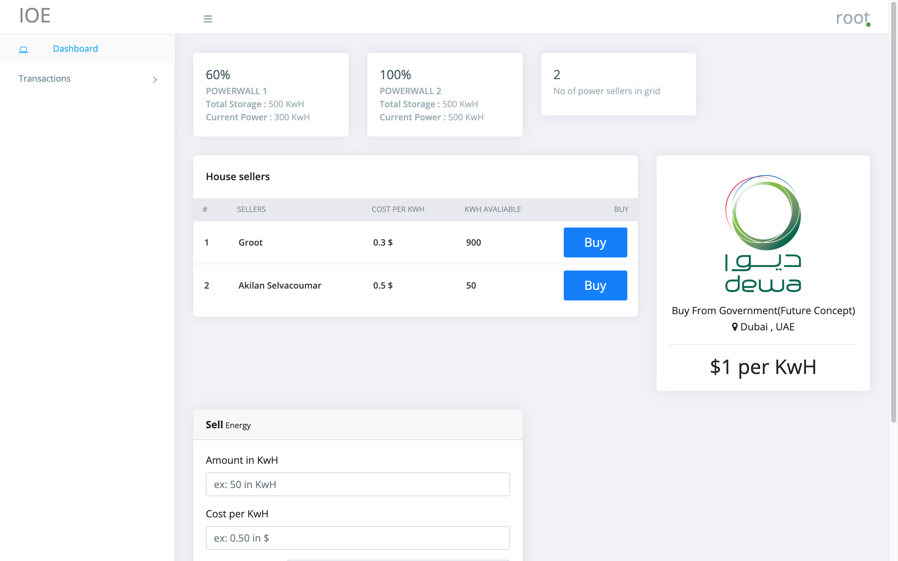
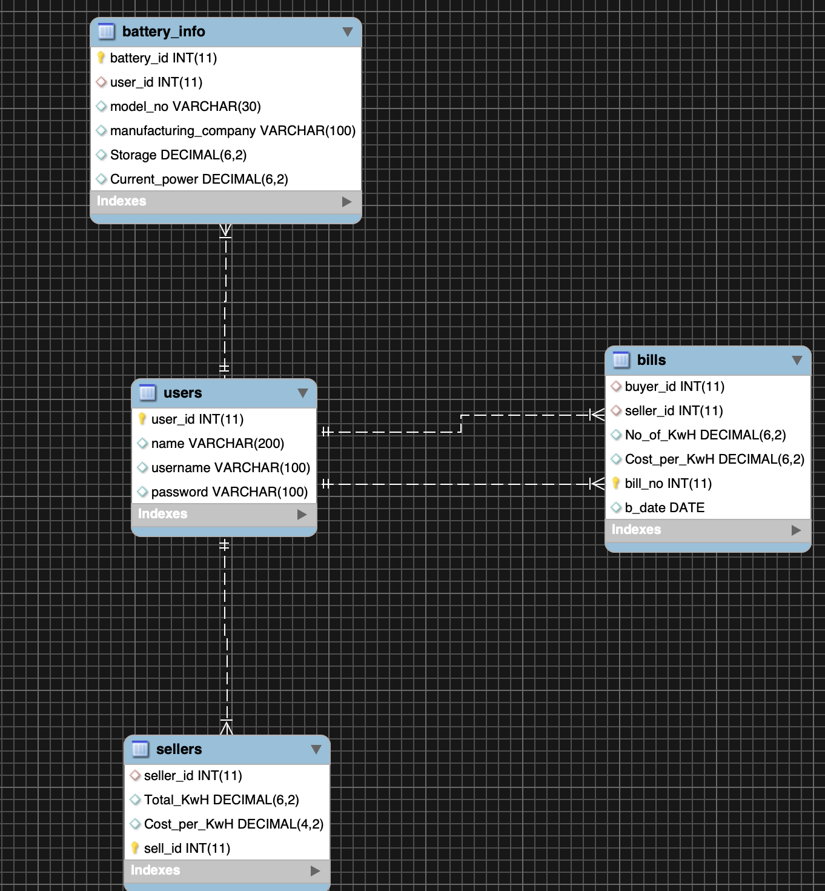

# Procedure to install and run the Code

### Clone the repo
```bash
git clone https://github.com/Akilan1999/Centralized_IOE.git
```
Navigate to the directory
```bash
cd Centralized_IOE/
```
### Add your sql username and password

Navigate to config/database.js
```javascript
var connection = mysql.createConnection({
  host: 'localhost',
  user: 'ADD YOUR USERNAME', //DB username
  password: 'ADD YOUR PASSWORD', //DB password
  database: 'shared_electricity'
});
```

### Adding the sql database to your localhost

1. Login to SQL
```bash
mysql -u root -p
```
2. Import shared_electricity.sql
```sql
mysql> source \shared_electricity.sql;
```

3. Basic insert statements which are nessary
```sql
mysql> insert into users values(0,'<your name>','<your username>','<your password>');
```
4. Only for testing you can do some inserts statement (Remember the primary is auto_increment so once a insert is done the that table -> The next inserts should done without inserting the primary key value as it's automatically incremented);

Ex: This is for adding batteries
```sql
mysql> insert into battery_info values(0,2,'POWERWALL 1','Solar City',500,300);
mysql> insert into battery_info(user_id,model_no, manufacturing_company,Storage,Current_power) values(2,'POWERWALL 2','Solar City',500,500);
```
### Start server
```sql
node app.js
```
URL: http://localhost:8003

### Login with the username and password in the DB.

If successful this should be your home page



### SQL Er-Diagram

